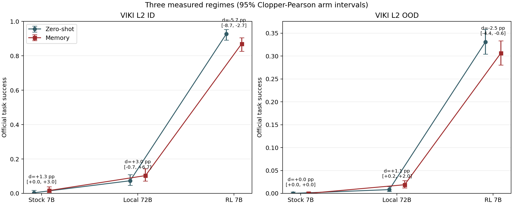

# VIKI Amendment 3: Local 72B Window Round

## Status

This round is a post-F1 local-model amendment. The preregistered F1 pick selected Gemini-2.5-Flash after no open model cleared every threshold; the user then explicitly authorized Qwen2.5-VL-72B for F2. The original pick artifact remains unchanged.

The primary OOD prediction held. Zero-shot was 10/1218 and segment memory was 23/1218 (delta +1.07 pp, exact McNemar p=0.035082).

## Paired Results

| Regime | N | Zero-shot | Memory | Delta [paired bootstrap 95%] | F->S | S->F | Exact p |
| --- | ---: | ---: | ---: | ---: | ---: | ---: | ---: |
| **ID** | | | | | | | |
| Stock 7B segment memory | 300 | 1/300 (0.33%) | 5/300 (1.67%) | +1.33 pp [+0.00, +3.00] | 5 | 1 | 0.21875 |
| Local 72B segment memory | 300 | 22/300 (7.33%) | 31/300 (10.33%) | +3.00 pp [-0.67, +6.67] | 21 | 12 | 0.162756 |
| RL 7B graded memory | 300 | 278/300 (92.67%) | 261/300 (87.00%) | -5.67 pp [-8.67, -2.67] | 3 | 20 | 0.000488281 |
| **OOD** | | | | | | | |
| Stock 7B segment memory | 1218 | 0/1218 (0.00%) | 0/1218 (0.00%) | +0.00 pp [+0.00, +0.00] | 0 | 0 | 1 |
| Local 72B segment memory | 1218 | 10/1218 (0.82%) | 23/1218 (1.89%) | +1.07 pp [+0.16, +1.97] | 23 | 10 | 0.035082 |
| RL 7B legacy skill memory | 1218 | 403/1218 (33.09%) | 373/1218 (30.62%) | -2.46 pp [-4.35, -0.57] | 55 | 85 | 0.0139573 |

The three regimes are descriptive rather than treatment-controlled: the stock and local-72B arms use the Amendment 2 segment bank, while the RL checkpoint uses earlier branch/legacy skill memories and a different context-budget policy.

## Local 72B OOD Families

| Family | N | Zero-shot | Memory | Delta [95%] | F->S | S->F | Exact p |
| --- | ---: | ---: | ---: | ---: | ---: | ---: | ---: |
| bring_bowl_to_table_plate_already_there | 409 | 0/409 (0.00%) | 10/409 (2.44%) | +2.44 pp [+0.98, +4.16] | 10 | 0 | 0.00195312 |
| bring_plate_and_bowl_to_table | 391 | 0/391 (0.00%) | 0/391 (0.00%) | +0.00 pp [+0.00, +0.00] | 0 | 0 | 1 |
| bring_plate_to_table_bowl_already_there | 418 | 10/418 (2.39%) | 13/418 (3.11%) | +0.72 pp [-1.44, +2.87] | 13 | 10 | 0.677639 |

## C-prime

Systematicity remains excluded as grammar-impossible. Instance and productivity each use 400 frozen rows; flat prompts are token-matched to skill-memory prompts within 5%.

| Channel | Arm | Success | Format |
| --- | --- | ---: | ---: |
| instance | zero_shot | 23/400 (5.75%) | 100.00% |
| instance | skill_memory | 28/400 (7.00%) | 96.75% |
| instance | flat_memory | 47/400 (11.75%) | 94.00% |
| productivity | zero_shot | 5/400 (1.25%) | 100.00% |
| productivity | skill_memory | 36/400 (9.00%) | 99.50% |
| productivity | flat_memory | 57/400 (14.25%) | 98.75% |

| Channel | Comparison | Delta [paired bootstrap 95%] | F->S | S->F | Exact p |
| --- | --- | ---: | ---: | ---: | ---: |
| instance | zero_shot_to_skill | +1.25 pp [-0.50, +3.25] | 10 | 5 | 0.301758 |
| instance | zero_shot_to_flat | +6.00 pp [+3.25, +8.75] | 28 | 4 | 1.93012e-05 |
| instance | flat_to_skill | -4.75 pp [-7.25, -2.25] | 4 | 23 | 0.000310749 |
| instance | flat token match | max 0.07%; prefix-trimmed 209 | | | |
| productivity | zero_shot_to_skill | +7.75 pp [+4.75, +10.75] | 35 | 4 | 3.35316e-07 |
| productivity | zero_shot_to_flat | +13.00 pp [+9.50, +16.50] | 55 | 3 | 2.25986e-13 |
| productivity | flat_to_skill | -5.25 pp [-9.50, -1.00] | 28 | 49 | 0.0220335 |
| productivity | flat token match | max 0.08%; prefix-trimmed 355 | | | |

## Diagnostics

On local-72B ID, zero-shot was 22/300 and memory was 31/300. No skill-memory instance was removed for the 16K budget. Detailed retained-instance and token-headroom distributions are stored in `f2_ood.summary.json`, `f2_id.summary.json`, and both C-prime summaries.

## Amendment 4: Flat-Pool Attribution

The final equal-pool segment-flat control matched skill memory: segment flat reached 46/400 and skill memory 36/400, a skill-minus-segment difference of -2.50 percentage points (paired 95% interval [-6.75, +1.50], exact McNemar p=0.288784). The active ingredient on VIKI is segment-granular content with pool breadth; the organization claim on VIKI is withdrawn and rests on PartNR, stated plainly.

### G0: Flat-Pool Leakage

The manifest fields establish that neither channel used all 6,699 M0 source train rows. The instance rows used task-restricted `allowed_instance_ids`, with `allowed_source_count` ranging from 170 to 1,141. Every productivity row used 10,359 `allowed_instance_ids` from 4,993 `allowed_source_indices`. The skill retriever and flat builder received the same allowed segment IDs, but the flat builder regrouped selected segments by `source_train_index` and injected whole source rows; those source rows were not necessarily single-unit.

The audit counts only source rows whose complete formatted segment blocks remained after token-level prefix trimming. Coverage uses the C2 definition: a contiguous ordered-unit subsequence covers the test row's full C0 signature.

| Channel | Rows with covering exemplar | Flat success / skill failure with cover | Injected multi-unit exemplars | Maximum grounded-plan trigram overlap |
| --- | ---: | ---: | ---: | ---: |
| instance | 89/400 (22.25%) | 18/23 (78.26%) | 198 | 1.00 |
| productivity | 143/400 (35.75%) | 38/49 (77.55%) | 245 | 1.00 |

The preregistered G0 branch therefore declared productivity confounded and triggered G2. Instance triggered no rerun by design; its original flat result is a memorization ceiling under permitted near-duplicate and whole-answer replay.

### G1: Route Quality

Route alignment projects C0 onto primitive `fetch`, `relocate`, and `state_change` units, excludes derived composite units to avoid double counting, and leaves navigation-only subgoals unscored. Strict route correctness requires exact primitive-kind multiset and order agreement plus a retrieval hit for every scorable predicted subgoal.

| Channel | Strict route-correct | Multiset agreement | Order agreement | Mean multiset F1 | Mean order LCS | Mean retrieval hit |
| --- | ---: | ---: | ---: | ---: | ---: | ---: |
| instance | 1/400 | 22.75% | 11.25% | 0.711 | 0.674 | 11.96% |
| productivity | 0/400 | 29.25% | 22.50% | 0.718 | 0.777 | 19.90% |

The strict preregistered route-correct comparison is not estimable at useful sample size: productivity has no strict-correct rows, while the sole instance strict-correct row was solved by both skill and flat. On route-incorrect rows, skill trailed the original flat by 4.76 points in instance (27/399 versus 46/399) and 5.25 points in productivity (36/400 versus 57/400). These strata do not distinguish routing-stage loss from composed-segment-format loss at this model scale.

For OOD, all 23 fixes and 10 regressions were strict-route-incorrect. Mean per-subgoal retrieval hit was 89.57% for fixes and 75.00% for regressions; mean primitive multiset F1 was 0.523 and 0.400, respectively. This is descriptive evidence that retrieval alignment was better on fixes, not a route-correct causal contrast.

### G2: Clean Flat

The primary clean pool contained the 171 M0 source rows whose C0 full signature is single-unit, represented by 319 segment instances. C0 source row 6075 was single-unit but absent from M0 and therefore not injectable. The optional original-pool-minus-covering arm was not run.

Preflight passed all 400 rows with zero symmetric drops, zero covering exemplars, 100% single-unit sources, and maximum token mismatch 0.0754% against the unchanged per-row 5% gate. All 400 zero-shot and skill prompts matched their original hashes. The rerun made exactly 400 generation calls, reused all zero-shot and skill outputs unchanged, discarded all 400 original flat outputs, and recorded a new run fingerprint.

| Arm | Success | Format |
| --- | ---: | ---: |
| zero-shot (reused) | 5/400 (1.25%) | 100.00% |
| skill memory (reused) | 36/400 (9.00%) | 99.50% |
| clean flat | 4/400 (1.00%) | 98.75% |

| Comparison | Paired delta | Left only | Right only | Exact p |
| --- | ---: | ---: | ---: | ---: |
| clean flat to skill | skill +8.00 pp | 3 | 35 | 6.67787e-08 |
| zero-shot to clean flat | clean flat -0.25 pp | 4 | 3 | 1.0 |
| zero-shot to skill | skill +7.75 pp | 4 | 35 | 3.35316e-07 |

The source-row-restricted clean control closes and reverses the original gap. On this intermediate control, skill memory beats clean flat by 8.00 points. Amendment 4.1 tests whether that difference is organization or the much broader segment pool.

### Amendment 4.1 / G2b: Equal-Pool Segment Flat

G2b is the final VIKI control. Per row, segment flat uses the exact 10,359 `allowed_instance_ids` supplied to the skill arm, representing 4,993 source rows. All candidate segments are single-unit and none covers the test full signature under C2. Retrieval is instruction-only MPNet cosine over segment contexts, with no subgoal prediction, skill matching, or grouping. Each segment uses the exact singleton skill-rendered block after its grouping header is removed.

The zero-call pool gate passed on all 400 manifest rows with one canonical pool hash. The full 10,359-segment renderer had zero template mismatches. On 20 deterministic sampled rows, 120/120 top-ranked pre-trim segments were byte-identical; after token trimming, all 20 final prompts were exact byte prefixes of the headerless segment rendering, with 35/35 complete segment blocks byte-identical and at most one partial token-trim suffix per row.

Preflight passed all 400 rows with zero symmetric drops, zero covering segments, 100% single-unit segments, and maximum token mismatch 0.0750% against the unchanged per-row 5% gate. All 400 zero-shot, clean-flat, and skill prompts matched their original hashes. The run made exactly 400 new calls, reused those three prior outputs unchanged, added only segment flat, and recorded a new fingerprint.

| Arm | Success | Format |
| --- | ---: | ---: |
| zero-shot (reused) | 5/400 (1.25%) | 100.00% |
| clean flat (reused) | 4/400 (1.00%) | 98.75% |
| segment flat | 46/400 (11.50%) | 96.00% |
| skill memory (reused) | 36/400 (9.00%) | 99.50% |

| Comparison | Paired delta [95%] | Left only | Right only | Exact p |
| --- | ---: | ---: | ---: | ---: |
| zero-shot to clean flat | -0.25 pp [-1.50, +1.00] | 4 | 3 | 1.0 |
| zero-shot to segment flat | +10.25 pp [+7.25, +13.50] | 3 | 44 | 2.46473e-10 |
| zero-shot to skill | +7.75 pp [+4.75, +10.75] | 4 | 35 | 3.35316e-07 |
| clean flat to segment flat | +10.50 pp [+7.50, +13.75] | 2 | 44 | 3.07523e-11 |
| clean flat to skill | +8.00 pp [+5.25, +11.00] | 3 | 35 | 6.67787e-08 |
| segment flat to skill | -2.50 pp [-6.75, +1.50] | 41 | 31 | 0.288784 |

The decomposition is therefore content-and-pool +10.25 points for segment flat over zero-shot, while organization is -2.50 points for skill over segment flat and is not significant. Segment flat statistically matches skill; the VIKI organization claim is withdrawn. The positive VIKI result is that segment-granular memory content with broad retrieval materially improves the local 72B model.

Organization here means the skill arm's routing, grouping, and ordering jointly, G2b does not separate those three, and routing is part of the structure being claimed. A further routed-but-ungrouped arm is possible at another 400 calls and is not required for the paper's claim.

The three-regime curve remains descriptive rather than treatment-controlled: memory variants and context-budget policies differ across regimes. VIKI generation is now closed under Amendment 4.1; no further VIKI arm is authorized. C4 remains blocked on the original PartNR memory banks and generation logs, and that user-side handoff is unchanged. The next VIKI deliverable is the chapter draft.

## Artifacts

- `results/viki_memory_experiments/amendment3/f2_local_override.json`
- `results/viki_memory_experiments/amendment3/f2_final_results.json`
- `results/viki_memory_experiments/amendment3/f2_final_tables.csv`
- `results/viki_memory_experiments/amendment3/f2_three_regime_curve.png`
- `results/viki_memory_experiments/amendment4/audit_summary.json`
- `results/viki_memory_experiments/amendment4/g0_flat_prompt_rows.parquet`
- `results/viki_memory_experiments/amendment4/g0_flat_prompt_exemplars.parquet`
- `results/viki_memory_experiments/amendment4/g1_cprime_route_rows.parquet`
- `results/viki_memory_experiments/amendment4/g1_ood_route_rows.parquet`
- `results/viki_memory_experiments/amendment4/g2_clean_flat.preflight.summary.json`
- `results/viki_memory_experiments/amendment4/g2_clean_flat.summary.json`
- `results/viki_memory_experiments/amendment4/g2_clean_flat.parquet`
- `results/viki_memory_experiments/amendment4/g2b_gates.summary.json`
- `results/viki_memory_experiments/amendment4/g2b_posttrim_render_gate.summary.json`
- `results/viki_memory_experiments/amendment4/g2b_segment_flat.preflight.summary.json`
- `results/viki_memory_experiments/amendment4/g2b_segment_flat.summary.json`
- `results/viki_memory_experiments/amendment4/g2b_segment_flat.parquet`
- `results/viki_memory_experiments/amendment4/VIKI_GENERATION_CLOSED.json`
