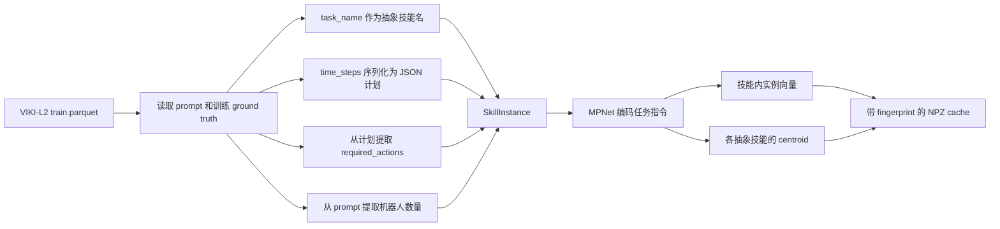
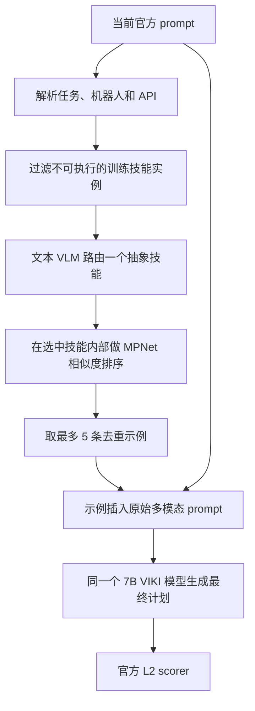

# VIKI L2-OOD 上的 Memory-as-Skill 实现说明

## 先说结论

我们做的不是把论文中的完整多智能体 Memory-as-Skill 原样搬到 VIKI，
而是把其中可以在 VIKI L2-OOD 上成立的**个体技能层次记忆**分支实现出来，
接到已发布的 VIKI-R 7B L2 模型前面，再与不加记忆的同一个模型做配对比较。

最终结果没有提升：

- 原始 7B L2-OOD baseline：`403 / 1218 = 33.09%`
- 加入个体技能记忆：`373 / 1218 = 30.62%`
- 绝对变化：`-2.46` 个百分点
- 55 条原本失败的样本变为成功，但 85 条原本成功的样本变为失败
- 双侧 exact McNemar 检验：`p = 0.013957`

也就是说，这个实现帮助了一个任务子类，但对另一个原本很强的任务子类造成了
更大的破坏，最终是统计显著的整体退化。

## 1. 我们要验证什么

要验证的问题很直接：

> 把训练集中的成功规划整理成“抽象技能 + 具体成功示例”，在推理时先选技能、
> 再检索同技能的示例，能否帮助已发布的 VIKI-R 7B 模型解决 L2-OOD？

公平比较要求 baseline 和 memory 方法使用：

- 同一个 released 7B L2 checkpoint
- 同一批 1,218 条 L2-OOD 样本，即 VIKI-L2 的 `val.parquet`
- 同一个官方 system prompt、当前任务文本和当前图片
- 同一个官方 L2 scorer
- greedy decoding，`temperature = 0`
- 最终规划最多生成 2,000 tokens

唯一有意增加的变量，是 memory 方法在最终规划前多做了一次技能路由，并把最多
5 条训练集成功示例放入最终 prompt。

## 2. 为什么不能直接复现论文完整方法

论文方法的核心不只有个体技能，还包括合作技能和基于环境变化的伙伴行为推断。
这些机制要求智能体在交互过程中看到前后状态变化，并据此推断另一个智能体做了
什么。VIKI L2-OOD 不具备这个观测结构。

| 项目 | 论文中的完整方法 | VIKI L2-OOD 实际条件 | 本实现 |
| --- | --- | --- | --- |
| 智能体 | 多智能体、去中心化执行 | 1,218 条样本全部只有一个机器人 | 只做个体技能 |
| 输入 | 连续局部观测和执行历史 | 一张静态图片和一条任务指令 | 单次静态规划 |
| 伙伴环境影响 | 可观察前后环境差异 | 没有伙伴，也没有下一时刻观测 | 无法实现 |
| 合作技能 | 根据 `partner_cond` 检索 | 没有可定义的 `partner_cond` | 明确关闭 |
| 个体技能 | 抽象技能下面保存情境化实例 | 训练集有成功任务及完整计划 | 已实现 |
| 检索 | 先选抽象技能，再选技能内实例 | 可以从训练集构建 | 已实现 |
| 可执行性检查 | 检查当前智能体能否执行 | prompt 给出了机器人 API | 已实现确定性过滤 |

所以准确名称应当是：

> **Memory-as-Skill 的 VIKI L2 个体技能适配**

它不能被表述为论文完整的 decentralized cooperation 方法。事实上，论文实验中
贡献很大的合作技能分支，恰好是这个 split 无法检验的部分。

## 3. 数据边界：什么能看，什么不能看

### 3.1 构建记忆时使用的数据

记忆库只读取：

```text
../VIKI-R/data/VIKI-R/viki/VIKI-L2/train.parquet
```

只加载其中的 `prompt` 和 `reward_model` 两列，共 7,196 条训练轨迹。
训练集的 `reward_model.ground_truth` 在这里被当作成功示范，使用其中：

- `task_name`：作为抽象技能名
- `time_steps`：作为这个技能的一条具体规划示例

最后得到：

- 7,196 条技能实例
- 14 个训练任务类别，也就是 14 个抽象技能
- 1,737 个不同的训练指令文本

训练和 OOD validation 的规范化任务指令没有 exact overlap；训练任务类别和 OOD
任务类别也没有同名重合。也就是说，没有按文本精确匹配把 validation 答案拿回来。

### 3.2 处理当前 OOD 样本时使用的数据

对于当前 validation 样本，路由和检索只读取官方 prompt 中已经公开给模型的信息：

- user message 中的任务指令
- system message 中的机器人集合
- system message 中每种机器人允许调用的 API

技能路由不读取当前样本的：

- `reward_model`
- `ground_truth.task_name`
- `ground_truth.time_steps`
- scorer 内部状态
- 图片

图片没有被丢掉，而是保留给最后一次真正生成计划的多模态调用。这样做的目的，是
让技能路由只判断“整条指令属于哪种可复用程序”，不要在看到图片后过早把条件任务
缩成一个当前动作；最后的规划器仍然必须根据当前图片判断碗或盘子到底缺哪一个。

## 4. 离线阶段：怎样建立技能记忆库

对应实现位于：

```text
habitat_llm/evaluation/viki_memory_skill.py
```

整体过程如下：



### 4.1 每条记忆实例保存什么

每个 `SkillInstance` 保存六项内容：

```text
train_index       训练集行号
skill_name        ground_truth.task_name
context           训练样本的用户任务指令
demonstration     ground_truth.time_steps 的紧凑 JSON 计划
required_actions  该计划用到的动作集合
robot_count       该训练样本的机器人数量
```

例如，一条训练计划如果使用了 `Move`、`Reach`、`Grasp`、`Place`，它的
`required_actions` 就是这四个动作。这个集合后面用于判断示例对当前机器人是否
可执行。

### 4.2 文本向量和技能中心

所有训练指令使用：

```text
sentence-transformers/all-mpnet-base-v2
```

编码为 768 维、已归一化的向量。相同训练指令只编码一次，再映射回对应实例，避免
重复计算。每个抽象技能的中心向量是该技能下所有实例向量的平均值再归一化：

$$
c_s = \operatorname{normalize}\left(\frac{1}{|I_s|}
\sum_{i \in I_s} e_i\right)
$$

其中 $e_i$ 是实例指令向量，$I_s$ 是技能 $s$ 的实例集合。

### 4.3 embedding cache

训练实例内容和 embedding 模型名共同计算 SHA-256 fingerprint。向量保存到：

```text
results/viki_l2_memory_skill_all_mpnet_base_v2.npz
```

只有 fingerprint 和实例数都一致时才加载 cache，否则重新编码。这样可以避免训练
数据或示例计划改变以后仍然误用旧向量。这个 cache 只节省初始化时间，不改变检索
结果。

## 5. 在线阶段：一条 OOD 样本怎样运行

真正连接 endpoint 的类是：

```text
habitat_llm/evaluation/viki_bench.py::MemorySkillEndpointProvider
```

一条样本会经过下面五步。



### 5.1 先做可执行性过滤

从当前 system prompt 解析：

```text
Available robot set
Their available operation APIs
```

训练实例只有同时满足下面两条才进入候选集合：

1. 训练实例的机器人数量等于当前样本的机器人数量。
2. 训练实例的 `required_actions` 是当前机器人可用 API 集合的子集。

在 L2-OOD 中所有样本都是单机器人，因此这里主要避免向一个能力受限的机器人提供
它无法执行的动作示例。过滤发生在技能路由之前，所以路由模型看到的候选技能本身
已经至少有一条可执行实例。

### 5.2 用 VLM 做抽象技能路由

对于每个仍可执行的抽象技能，取最多两个较短且不同的训练指令作为技能说明。然后
给同一个 VIKI-R 7B endpoint 发一个**纯文本**路由请求，内容大意是：

```text
当前完整任务：<current instruction>

候选技能：
- <skill name A>
  Successful contexts: <train context 1> | <train context 2>
- <skill name B>
  Successful contexts: ...

请按完整条件策略选择一个技能，不要只按共享词匹配，
先在 <think> 中推理，再把精确技能名放进 <answer>。
```

路由最多生成 768 tokens，`temperature = 0`。要求模型选择“覆盖整条条件指令的
程序”，而不是根据图片判断当前只需要搬碗还是搬盘子。

选择结果按以下顺序处理：

1. 如果最后一个闭合的 `<answer>...</answer>` 能匹配可执行技能名，直接选中，
   并把路由相似度记为 `1.0`。
2. 如果没有闭合 answer，或 answer 不是候选技能名，则把整段路由输出编码成
   MPNet 向量，与可执行技能 centroid 做余弦相似度，选择最接近的技能。
3. 如果这个 fallback 相似度低于 `0.3`，不注入任何记忆，退回原始 prompt。

这里有一个必须直说的实现细节：**当 VLM 精确输出合法技能名时，相似度被设为
1.0，所以 0.3 阈值不会拒绝这个选择。** 阈值实际主要约束 centroid fallback，
并不是对每条检索示例逐条做最低相似度过滤。

全量运行中：

- 1,217 / 1,218 条路由输出包含闭合 `<answer>`
- 137 条仍进入 centroid fallback，通常是 answer 内容没有合法匹配候选技能
- 1,057 条命中了技能路由 cache

路由 cache 的 key 是完整的纯文本路由 messages。它只避免相同路由问题重复请求
VLM；每个样本最后的图片规划仍然单独执行，因此 cache 不会复用最终计划。

### 5.3 在选中的技能内部检索实例

当前任务指令也用 MPNet 编码为归一化向量 $q$。只在已选技能、机器人数量相同且
动作可执行的训练实例中计算：

$$
\operatorname{sim}(q, e_i) = q^\top e_i
$$

然后按相似度从高到低排序；相同分数按训练行号稳定排序。检索时使用：

```text
top_k = 5
```

完全相同的 `(context, demonstration)` 组合只保留一次。这里的层次性是：

```text
先选一个抽象 skill_name
    -> 再只在这个 skill_name 的实例中做语义近邻检索
```

而不是把 7,196 条计划全部混在一起直接做一次 top-k。

### 5.4 把记忆放回多模态 prompt

检索结果被格式化为：

```text
Memory-as-Skill guidance from successful training trajectories:
Predicted abstract skill: <skill name>
Executable grounded instances:
1. Context: <training instruction>
   Demonstration: <training plan JSON>
...
Use these as structural skill examples only.
Ground the plan in the current image, current task entities, and current robot APIs;
do not copy training entity names blindly.

Current task:
<original current instruction>
```

原始图片 item 保持原位，当前任务文本放在记忆示例之后。最后再次调用同一个 released
7B L2 模型生成计划，最多 2,000 tokens，`temperature = 0`。

因此每条未命中路由 cache 的样本需要两次模型调用：

1. 纯文本技能路由调用。
2. 带当前图片和检索示例的最终规划调用。

命中路由 cache 时只需要第二次调用。

## 6. 为什么最终仍然属于视觉规划

技能路由故意不看图，但最终规划一定看当前图片。两步承担不同职责：

- 路由回答：“这是一种什么完整任务程序？”
- 最终规划回答：“根据眼前图片，这个程序现在具体要操作哪个物体？”

例如任务要求“检查桌面，碗或盘子缺哪个就搬哪个”，路由应该保留这个完整条件策略，
不能在路由阶段就把它简化为“搬盘子”。最终模型才根据图片判断桌上已有的是碗还是
盘子，并生成对应的 `Move -> Reach -> Grasp -> Move -> Place` 计划。

这也是我们从早期版本改为 text-only routing 的原因：让路由看图会导致它过早专门化
成一个单物体动作，从而失去条件任务的完整语义。

## 7. 实验过程中试过但没有采用的方案

### 7.1 直接用任务文本匹配技能 centroid

最初只比较当前指令和 14 个技能 centroid。它容易被共享实体词误导，例如因为都出现
了 `plate`，把条件餐具任务路由到语义并不对应的训练技能。说明仅靠全局文本相似度
不足以做抽象程序选择。

### 7.2 让路由模型看图片

图像条件路由经常把“检查两个条件并补齐缺失项”的程序，缩成图片当前触发的一个
单物体动作。这不利于检索可复用的完整技能，因此最终路由只看任务文本。

### 7.3 用 `guided_choice` 强制选择技能名

这个 checkpoint 在约束解码下表现出明显的首选项偏置，经常选择候选列表中的第一项，
即使调整候选描述也没有解决。因此最终允许模型先输出 reasoning，再解析
`<answer>`；解析失败时才用 centroid fallback。

### 7.4 路由 token 太短

路由模型有时需要较长 reasoning 才会关闭 `<answer>`。最终将实验配置冻结为 768 个
路由 tokens；最终规划预算仍为 2,000 tokens。

## 8. 评测过程

### 8.1 开发和冻结

实验过程分三段：

1. 用索引 0--9 的 10 条样本调试路由格式和 token budget。最终版本为 3/10，原始
   baseline 为 4/10。
2. 参数冻结后先跑索引 10--109 的 100 条样本。memory 为 41%，baseline 为 36%，
   提升 5 个百分点，但 McNemar `p = 0.2668`，不显著。
3. 不再改参数，跑完剩余 1,108 条，并合并成完整的 1,218 条配对结果。

100 条 pilot 的正结果没有在全量数据上保持。这也是为什么不能根据小样本就报告方法
有效。需要同时说明：前 10 条参与过实现调试，因此全量数字是完整 benchmark 对比，
不是一个从未用于任何开发决策的纯 holdout 估计；不过最终观察到的是负提升，而不是
利用这部分调试夸大正结果。

### 8.2 冻结参数

| 参数 | 值 |
| --- | --- |
| 模型 | released Qwen2.5-VL 7B VIKI-R L2 checkpoint |
| checkpoint revision | `dd3b6a42aea5dfad42607bd538a68474e9b7f9c2` |
| embedding | `all-mpnet-base-v2`, 768 维 |
| `top_k` | 5 |
| similarity threshold | 0.3 |
| skill routing max tokens | 768 |
| final planning max tokens | 2,000 |
| temperature | 0 |
| model context | 4,096 |
| 数值精度 | BF16 |

### 8.3 运行入口

模型通过 OpenAI-compatible endpoint 提供服务后，评测入口是：

```bash
python -m habitat_llm.evaluation.viki_bench \
  --benchmark-root ../VIKI-R \
  --level 2 \
  --split val \
  --provider memory-endpoint \
  --base-url http://127.0.0.1:8000/v1 \
  --model YOUR_SERVED_MODEL_NAME \
  --workers 4 \
  --temperature 0 \
  --max-tokens 2000 \
  --memory-top-k 5 \
  --memory-similarity-threshold 0.3 \
  --memory-prediction-max-tokens 768 \
  --memory-embedding-model all-mpnet-base-v2 \
  --memory-cache results/viki_l2_memory_skill_all_mpnet_base_v2.npz \
  --output results/viki_memory_skill_7b_l2_ood.jsonl
```

baseline 使用同样的 endpoint 和生成参数，只把 provider 改为 `endpoint`，不做路由、
检索和示例注入。

### 8.4 指标

主指标是官方 L2 的 `task_score`，即计划是否可执行并满足目标；不是训练用组合奖励
`score`。另外单独统计：

- `format_score`：输出格式是否正确
- `error`：endpoint 或评测运行错误
- paired flips：同一索引上 baseline 和 memory 的成败变化

对 55 个 failure-to-success 和 85 个 success-to-failure 做双侧 exact McNemar 检验：

$$
p = 2P\left[\operatorname{Binomial}(140, 0.5) \le 55\right]
  = 0.013957
$$

## 9. 全量结果

| OOD 任务 | 样本数 | Baseline 成功 | Memory 成功 | Baseline | Memory | 变化 |
| --- | ---: | ---: | ---: | ---: | ---: | ---: |
| 缺碗，盘子已在桌上 | 409 | 13 | 47 | 3.18% | 11.49% | +8.31 pp |
| 缺盘子，碗已在桌上 | 418 | 387 | 326 | 92.58% | 77.99% | -14.59 pp |
| 碗和盘子都缺 | 391 | 3 | 0 | 0.77% | 0.00% | -0.77 pp |
| **全部** | **1,218** | **403** | **373** | **33.09%** | **30.62%** | **-2.46 pp** |

配对变化进一步说明了不对称性：

| OOD 任务 | 失败变成功 | 成功变失败 |
| --- | ---: | ---: |
| 缺碗，盘子已在桌上 | 38 | 4 |
| 缺盘子，碗已在桌上 | 17 | 78 |
| 碗和盘子都缺 | 0 | 3 |
| **全部** | **55** | **85** |

运行完整性：

- 1,218 个索引完整覆盖 `0..1217`，无重复
- endpoint errors：0
- format compliance：100%
- memory `mean_task_score = 0.3062397373`
- memory 训练式组合奖励 `mean_score = 0.3756157635`

## 10. 路由实际选了什么

最终 1,218 条样本的抽象技能路由分布是：

| 训练技能名 | 次数 |
| --- | ---: |
| `ensure_all_fruits_on_table` | 612 |
| `single_move_asset_to_target` | 258 |
| `sequential_pick_two_and_place` | 227 |
| `serve_bread_after_checking_cabinet` | 96 |
| `dog_check_environment` | 25 |

这里暴露出一个关键问题：OOD 是碗/盘子条件任务，但抽象技能名直接来自训练集
`task_name`。训练任务 taxonomy 与 OOD 任务并不对齐，路由器只能借用“程序结构相似”
但表面名称和实体很不相同的技能。`ensure_all_fruits_on_table` 被选中 612 次，说明它
可能被当作“检查并补齐所有要求对象”的代理技能；这种迁移有时有用，但也容易把水果
任务里的对象和步骤偏置带进餐具任务。

## 11. 为什么总体变差

结果支持下面三个判断。

### 11.1 记忆确实能补一部分弱项

在“缺碗”子类上，成功率从 3.18% 提升到 11.49%，38 条失败变成功而只有 4 条反向
退化。这说明训练成功示例提供的动作分解对 checkpoint 的弱方向有帮助。

### 11.2 但示例会干扰原本正确的视觉落地

“缺盘子”是 baseline 的强项，原本达到 92.58%。加入示例后降到 77.99%，有 78 条
原本成功的样本变失败。检查具体 paired case 时出现过这种情况：检索上下文和当前
任务都指向 plate，但最终模型仍错误操作 bowl。它说明更长的示例 prompt 不只是提供
知识，也会重新分配模型注意力，干扰当前图片中的实体选择。

这与论文中提到的 negative transfer 现象一致：当 base model 本来已经擅长某个任务
方向时，检索示例可能过度约束一个本来正确的 reasoner。

### 11.3 当前记忆没有解决双物体规划

“碗和盘子都缺”的 391 条样本，baseline 只有 3 条成功，memory 为 0。虽然 227 条
路由到了 `sequential_pick_two_and_place`，检索到程序结构相似的示例仍不足以让模型
稳定完成 OOD 双物体条件计划。问题不只是缺一个动作模板，还涉及图片实体识别、完整
条件解析和多段计划保持。

## 12. 实现与论文方法的具体差异

下面这些不是文字上的小改动，而是会影响结论外推范围的实质差异：

1. 论文用 LLM 从轨迹的子目标边界抽取技能；这里直接用训练
   `ground_truth.task_name` 作为技能名，没有重新学习更适合 OOD 的抽象 taxonomy。
2. 论文保存个体技能和合作技能；这里只保存个体技能。
3. 论文根据连续观测差分推断伙伴 effect；这里没有连续执行历史，完全没有这一步。
4. 论文可以在执行过程中的技能切换点多次检索；这里对一张图片只检索一次，然后一次性
   输出完整计划。
5. 论文的 executability 可以由 LLM 检查条件；这里使用机器人数量和动作 API 子集做
   确定性过滤，不检查当前图片中的对象是否真的可达或存在。
6. 这里用 released VIKI checkpoint 本身做技能路由，而不是论文中用于构建和运行
   memory 的同一套 agent trajectory pipeline。

因此这次实验能回答的是：

> **train-only 的层次个体技能 RAG 是否能直接改善 released VIKI-R 7B 在静态
> L2-OOD 上的计划成功率？**

答案是不能，当前实现整体下降 2.46 个百分点。

它不能回答的是：

> **论文完整的合作记忆和 effect-based partner inference 在 VIKI 多智能体连续执行中
> 是否有效？**

当前 L2-OOD split 没有提供回答这个问题所需的数据结构。

## 13. 代码和结果文件

| 文件 | 作用 |
| --- | --- |
| `habitat_llm/evaluation/viki_memory_skill.py` | 训练记忆构建、embedding cache、可执行过滤、技能匹配、实例检索和 prompt 注入 |
| `habitat_llm/evaluation/viki_bench.py` | `memory-endpoint` provider、路由 cache、两次 endpoint 调用、metadata 和官方评测 |
| `habitat_llm/tests/test_viki_bench.py` | 路由、API 可执行过滤、threshold fallback、图片保留和无 target 泄漏测试 |
| `results/viki_memory_skill_7b_l2_ood.jsonl` | 1,218 条最终逐样本结果和检索 metadata |
| `results/viki_memory_skill_7b_l2_ood.summary.json` | 聚合结果、配对变化、分任务结果和路由统计 |
| `results/viki_official_7b_l2_ood.jsonl` | 同 checkpoint 的 frozen baseline 逐样本结果 |

结果 JSONL 中每条 memory 记录的 `provider_metadata` 还保存：

- 预测技能名
- 技能路由相似度
- 原始路由输出
- 是否命中路由 cache
- 每条检索实例的训练行号、技能名、上下文、相似度、动作集合和机器人数量

这些字段使每个成功或失败样本都可以追溯到实际使用了哪些训练示例。

## 14. 验证状态

最终实现通过了 17 个 focused tests，三个编辑过的 Python 文件可以成功编译，VS Code
诊断无错误。结果文件经过独立重算并确认：

- 样本数和索引覆盖正确
- baseline 与 memory 索引一一对应
- 成功数为 403 对 373
- paired flips 为 55 对 85
- summary 中的均值和 exact McNemar p-value 与逐行重算一致

所以这里的负结果不是格式失败、漏样本或 endpoint 错误造成的，而是加入当前形式的
检索记忆后，任务规划行为本身发生了净退化。
